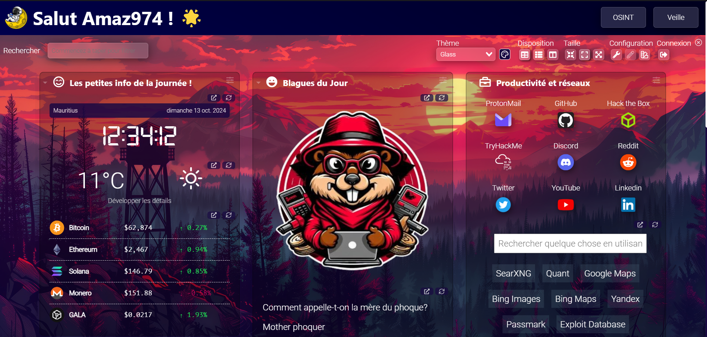
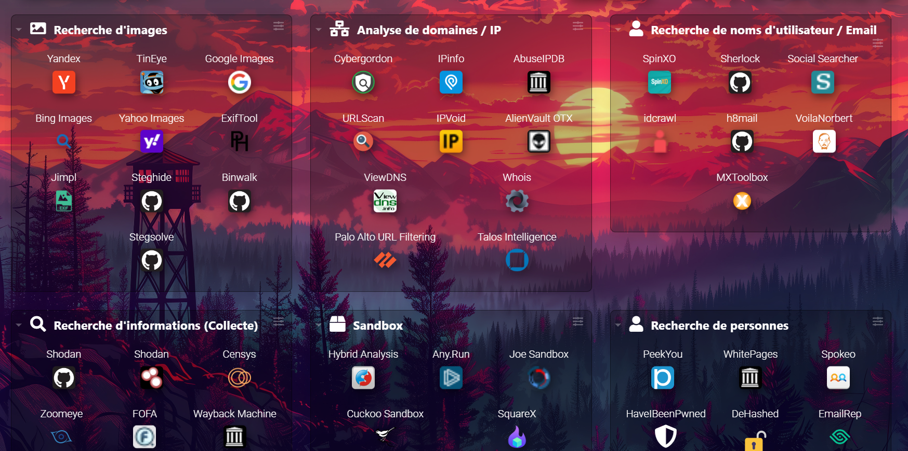
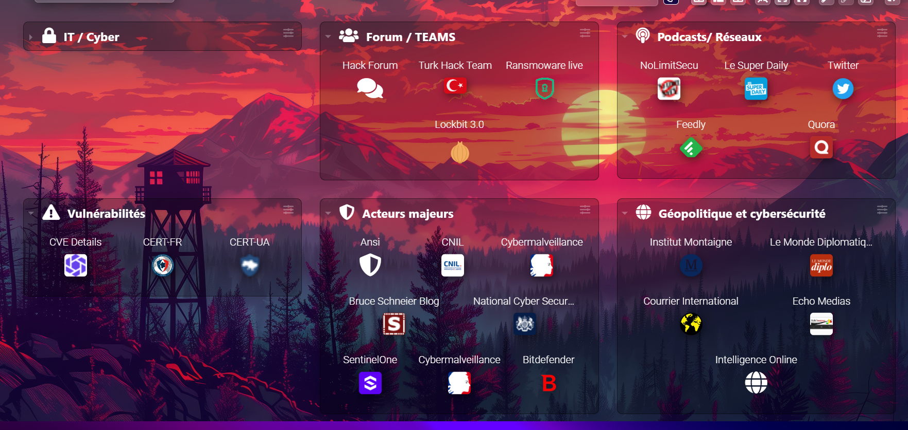

# Présentation de mon projet Dashy 🚀

---

## Qu'est-ce que Dashy ? 🖥️

[Dashy](https://dashy.to) est une application open-source qui permet de créer des tableaux de bord personnalisés pour organiser et visualiser des services, liens, et informations importantes. Vous pouvez configurer vos tableaux de bord selon vos besoins et choisir parmi une grande variété de widgets.  
[Documentation officielle de Dashy](https://dashy.to/docs)

---

## But du projet 🎯

L'objectif de ce projet est de créer un tableau de bord regroupant plusieurs outils d'**OSINT** (recherche d'information), d'analyse de données, ainsi que des outils de veille technologique et géopolitique. L'idée est de centraliser ces ressources pour faciliter l'accès et le suivi d'informations importantes pour les analystes et experts en cybersécurité.

---

## Les Widgets dans Dashy 🛠️

Dans Dashy, un **widget** est un élément interactif que vous pouvez ajouter à votre tableau de bord, tel qu'une horloge, des données météo, un suivi de cryptomonnaies, etc. Dashy propose plusieurs widgets prêts à l'emploi pour personnaliser votre tableau de bord.  
Vous pouvez consulter la liste complète des widgets dans la [documentation des widgets](https://dashy.to/docs/widgets).

---

## Sécurisation des mots de passe 🔐

La sécurité est un aspect essentiel, surtout lorsqu'il s'agit de gérer un tableau de bord avec des informations sensibles. Dans ce projet, j'ai utilisé une configuration basique de mot de passe car le projet est en localhost (je vous rassure les ID Admin ne sont pas Admin - Admin 🤣). Vous pouvez sécuriser Dashy en utilisant des solutions comme **Keycloak** pour la gestion des identités et des droits d'accès. Dashy prend en charge plusieurs méthodes d'authentification pour sécuriser vos utilisateurs et vos données.  
Découvrez plus sur les méthodes d'authentification dans la [documentation sur l'authentification]([https://dashy.to/docs/auth](https://dashy.to/docs/authentication/)).

---
# Démonstration 📸

---

## Accueil 🏠
Voici à quoi ressemble la page d'accueil de Dashy :

---

## Page OSINT 🔍
Découvrez l'interface de la page OSINT, conçue pour regrouper des outils d'analyse et de recherche d'information :

---

## Page Veille 🌐
Explorez la page Veille, dédiée à la surveillance technologique et géopolitique :

---

> Ce projet est open source et je continue à ajouter des outils régulièrement, toute contribution est la bienvenue ! Si vous avez des idées, suggestions ou simplement envie d'aider n'hésitez pas à me contacter. Ensemble, nous pouvons rendre ce tableau de bord encore plus complet et utile à la communauté !🥳

